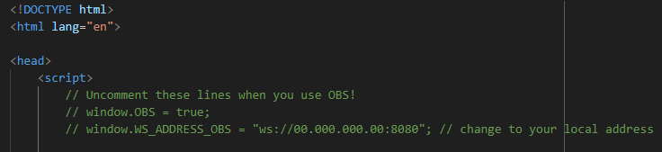
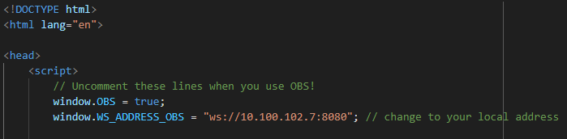

# Local Webcam

A tool used to share webcam feed from one device on a local network to another one!

## Device with a webcam

You need to run the ElectronJS app in order to start a WS host and send your feed to others!

## Receiver

Just open the `index.html` file in your browser!

> [!IMPORTANT]
> If you're using OBS, make sure to edit the `index.html` file!
>
> 
>
> 
